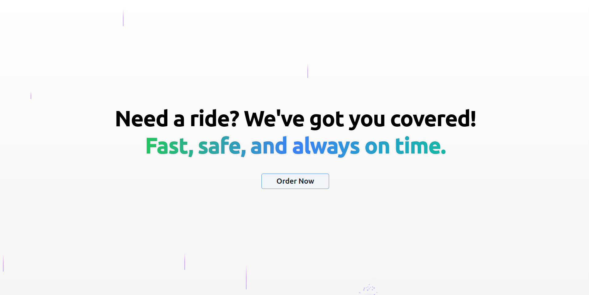
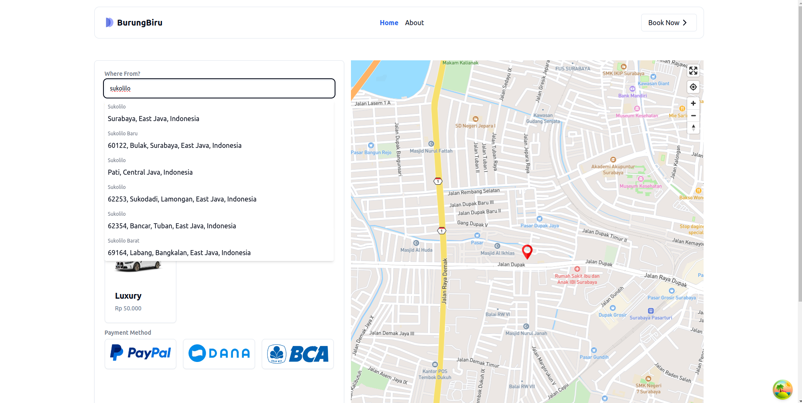
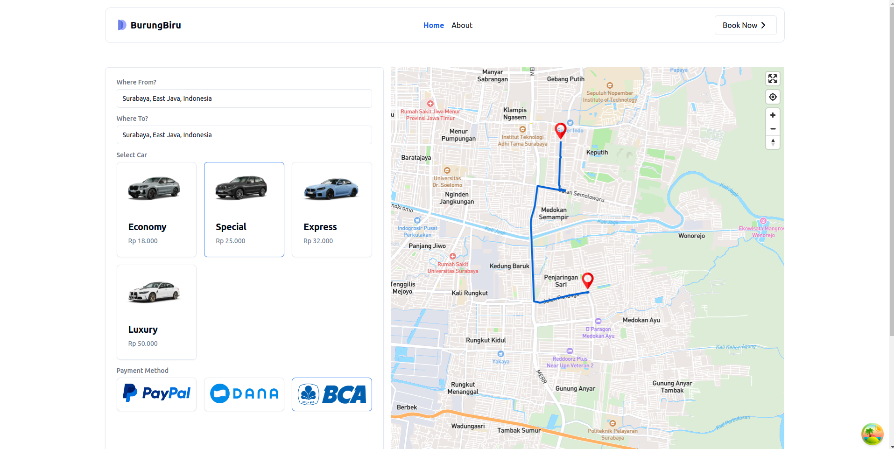

# BurungBiru - Online Taxi Ordering Platform

**BurungBiru** is a modern platform that allows users to order taxis online with ease. Built with cutting-edge technologies, it provides a seamless user experience, integrating real-time map interactions and fast data handling.

## 🚀 Features

- **Real-time Map Integration**: Powered by Mapbox for live location tracking and routing.
- **Online Taxi Ordering**: Users can order a taxi and get real-time directions.
- **Fast and Efficient**: Leverages React Query for efficient data fetching and caching.
- **Modern UI**: Built using **shadcn/ui** for a clean, accessible, and responsive interface.
- **Server Actions**: Efficient server-side operations using Next.js server actions.

## 🛠️ Tech Stack

- **Next.js**: Full-stack framework for the web.
- **shadcn/ui**: A beautiful and customizable UI library.
- **React Query**: Data-fetching and caching for API interactions.
- **Mapbox**: Interactive maps for live tracking and route management.
- **TypeScript**: Type-safe coding environment.

## 🖥️ Screenshots

(Include screenshots here of the app interface, e.g., the main map page, order confirmation, etc.)

| Home Page                            | Live Search                                   | Live Route                                  |
| ------------------------------------ | --------------------------------------------- | ------------------------------------------- |
|  |  |  |

Made with ❤️ by Aswinnn
